# Zapplebot ⚡️🍎🤖

A Discord bot for small community servers (~30 users). Responds to mentions, calls tools autonomously, and maintains persistent per-user memory.

Runs on **Bun + TypeScript** with a local or cloud LLM backend.

---

## Tech Stack

| Layer | What |
|---|---|
| Runtime | Bun |
| Bot | discord.js |
| LLM | llama.cpp (local) · OpenAI · Claude (cloud) |
| Tool Schema | zod + zod-to-json-schema |
| Memory | lowdb (JSON flat file) |
| Logging | Winston (structured JSON → `chat.log`) |
| HTTP | Hono (port 8586 — `/health`, `/webhook`) |

---

## Quick Start

### 1. Install dependencies

```bash
bun install
```

### 2. Set up the LLM backend

**Option A — Local (llama.cpp)**

```bash
# Install llama.cpp
# Linux: build from source (see MAC_MINI_SETUP.md for macOS)
# Then start the server:
llama-server \
  -m /path/to/model.gguf \
  --host 127.0.0.1 \
  --port 8888 \
  --api-key yourkey \
  --parallel 1 \
  -c 4096 \
  -ngl 99   # GPU offload — omit if CPU-only
```

Or use the included systemd service (Linux):

```bash
# edit ~/.config/systemd/user/llama-server.service
systemctl --user enable --now llama-server
```

**Option B — Cloud**

Set `LLM_BACKEND=openai` or `LLM_BACKEND=claude` in `.env` (see Environment Variables below).

### 3. Create `.env`

```env
# Discord
DISCORD_TOKEN=your_bot_token
DISCORD_CLIENT_ID=your_client_id
BOTLAND_CHANNEL_ID=channel_id_for_unprompted_replies

# LLM backend: llama | openai | claude  (default: llama)
LLM_BACKEND=llama

# llama.cpp (used when LLM_BACKEND=llama)
LLAMA_BASE_URL=http://127.0.0.1:8888
LLAMA_API_KEY=yourkey
LLAMA_MODEL=local-model

# OpenAI (used when LLM_BACKEND=openai)
OPENAI_API_KEY=sk-...
OPENAI_MODEL=gpt-4o-mini

# Claude / Anthropic (used when LLM_BACKEND=claude)
ANTHROPIC_API_KEY=sk-ant-...
CLAUDE_MODEL=claude-haiku-4-5-20251001

# GitHub (for github tools: bugReport, readBugs, readRepoFile)
GH_PAT=github_pat_...

# Webhook secret for POST /webhook (generate with: openssl rand -hex 32)
WEBHOOK_SECRET=your_secret_here

# Feature flags (optional)
ENABLE_DND=false          # set true to enable dnd_combat tool and /dnd slash commands

# Embedding model for memory similarity search (optional)
# If unset or if the model doesn't support embeddings, falls back to recency-based retrieval
LLAMA_EMBED_MODEL=local-model
```

### 4. Run the bot

The bot runs as a **systemd user service** — not directly via `bun run`.

```bash
# First-time setup
systemctl --user enable --now zapplebot.service

# After making code changes, restart to pick them up
systemctl --user restart zapplebot.service

# Other controls
systemctl --user stop zapplebot.service
systemctl --user status zapplebot.service

# Package scripts
bun run restart-bot
bun run restart-cron
```

Service files live in `~/.config/systemd/user/`.

---

## After Making Changes

**Always restart the service to apply code changes:**

```bash
systemctl --user restart zapplebot.service
```

If you changed the systemd service file itself:

```bash
systemctl --user daemon-reload
systemctl --user restart zapplebot.service
```

---

## Switching LLM Backends

Change `LLM_BACKEND` in `.env` and restart the bot. Claude Code slash commands are available:

```
/use-haiku   # switch to Claude Haiku
/use-llama   # switch back to local llama.cpp
```

---

## Tools

The bot selects tools autonomously — no slash commands needed for most. A tool-picker pre-pass selects ≤3 relevant tools per request to stay within the LLM context window.

| Tool | What it does |
|---|---|
| `roll_dice` | Roll any dice notation (e.g. 4d6) |
| `update_score_board` | Give or take points from a user |
| `get_score_board` | Show all scores |
| `score_board_score_names` | List available score categories |
| `add_persistent_memory` | Save a long-term fact about a user |
| `search_wikipedia` | Search Wikipedia by keyword via sub-agent |
| `follow_wikipedia_link` | Summarise a Wikipedia URL dropped in chat |
| `run_typescript_javascript` | Execute code in a sandboxed Docker container |
| `bugReport` | File a GitHub issue on this repo |
| `readBugs` | List open GitHub issues (with optional label/query filter) |
| `readRepoFile` | Read a file from this repo via GitHub API |
| `get_tech_stack` | Return info about the bot's own runtime and stack |
| `get_uptime` | Show how long the bot has been running |
| `get_current_date` | Return today's date as an ISO string |
| `get_time_zone` | Return the configured timezone string |
| `get_location` | Return the bot's host city and state |
| `get_snow_emergency` | Current Minneapolis snow emergency status |
| `get_weather` | Current Minneapolis weather plus observed-vs-projected precipitation today |
| `run_vela_cli` | Inspect Vela CI/CD state via the local Vela CLI (read-only commands only) |
| `dnd_combat` | D&D 5e kobold/goblin combat simulator — **requires `ENABLE_DND=true`** |

---

## HTTP API

A Hono server runs on port 8586 alongside the bot.

### `GET /health`

Returns current uptime — no auth required.

```bash
curl http://localhost:8586/health
# {"uptime":"2h 15m 4s","started_at":"2026-03-14T20:28:04.000Z"}
```

### `POST /webhook`

Post a message directly to botland. Requires HMAC-SHA256 signature.

```bash
SECRET=your_webhook_secret
BODY='{"message":"hello from webhook"}'
SIG="sha256=$(echo -n "$BODY" | openssl dgst -sha256 -hmac "$SECRET" -hex | awk '{print $2}')"
curl -X POST http://localhost:8586/webhook \
  -H "Content-Type: application/json" \
  -H "X-Signature-SHA256: $SIG" \
  -d "$BODY"
```

Or use the bundled script:

```bash
bun run webhook "your message here"
```

---

## Cron Jobs

| Timer | Schedule | Purpose |
|---|---|---|
| `zapplebot-snow-cron.timer` | every 30 min | Check Minneapolis snow emergency, post to botland if status changed |

```bash
systemctl --user status zapplebot-snow-cron.timer
systemctl --user start zapplebot-snow-cron.service   # run immediately
```

---

## How It Works

```
Discord message
  → isMention? → yes → handle immediately
  → in botland? → judge LLM decides if bot should reply
      → handleMessage()
          → fetch relevant memories (cosine similarity or recency fallback)
          → tool picker: 1 LLM call picks ≤3 relevant tools
          → agentic tool loop (MAX_TURNS=5, then forces text reply)
          → send reply + optional tool trace attachment
```

**Tool picker**: before the main loop, a lightweight LLM call receives a compact one-line-per-tool menu and returns a JSON array of ≤3 tool names. This reduces main-call prompt tokens from ~1,900 (all 20 tools) to ~450, keeping multi-turn tool calls within the 4,096-token context window. `add_persistent_memory` is always included. Falls back to all tools if the picker response is unparseable.

**Agentic loop**: the bot can call multiple tools in sequence before replying. Capped at `MAX_TURNS=5`; on the sixth turn, tools are stripped from the request to force a text response and prevent infinite loops. Each turn is logged with timing, token usage, and tool results.

**Judge**: a fast single-call to the LLM (max 20 tokens) to gate unprompted replies in botland. Returns `{"should_reply": true/false}`.

---

## Sequence Diagrams

### 1. Discord Message Entry & Judge Gate

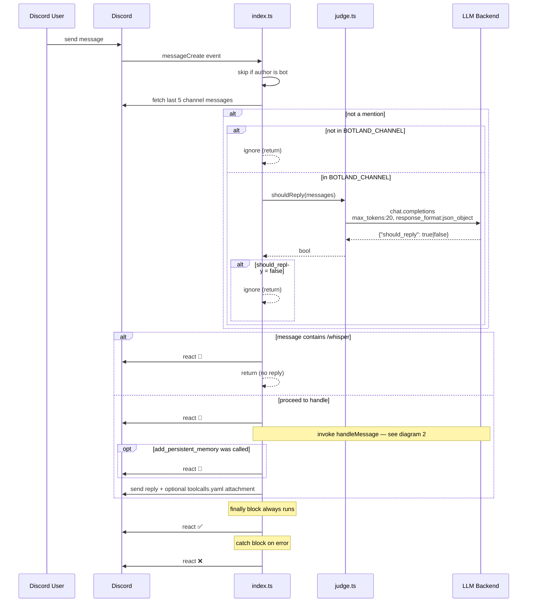
```mermaid
sequenceDiagram
    participant User as Discord User
    participant Discord
    participant Bot as index.ts
    participant Judge as judge.ts
    participant Llama as LLM Backend

    User->>Discord: send message
    Discord->>Bot: messageCreate event
    Bot->>Bot: skip if author is bot
    Bot->>Discord: fetch last 5 channel messages

    alt not a mention
        alt not in BOTLAND_CHANNEL
            Bot-->>Bot: ignore (return)
        else in BOTLAND_CHANNEL
            Bot->>Judge: shouldReply(messages)
            Judge->>Llama: chat.completions<br/>max_tokens:20, response_format:json_object
            Llama-->>Judge: {"should_reply": true|false}
            Judge-->>Bot: bool
            alt should_reply = false
                Bot-->>Bot: ignore (return)
            end
        end
    end

    alt message contains /whisper
        Bot->>Discord: react 🙉
        Bot-->>Bot: return (no reply)
    else proceed to handle
        Bot->>Discord: react 👀
        Note over Bot,Llama: invoke handleMessage — see diagram 2
        opt add_persistent_memory was called
            Bot->>Discord: react 📌
        end
        Bot->>Discord: send reply + optional toolcalls.yaml attachment
    end
    Note over Bot: finally block always runs
    Bot->>Discord: react ✅
    Note over Bot: catch block on error
    Bot->>Discord: react ❌
```

---

### 2. Handle Message — Memory Retrieval, Tool Picker & Agentic Loop

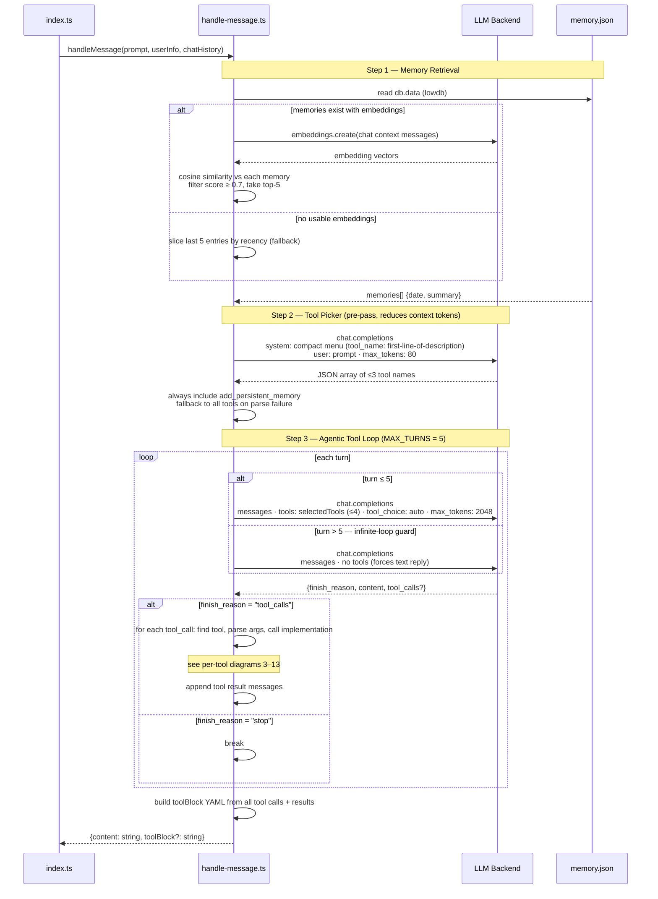
```mermaid
sequenceDiagram
    participant Bot as index.ts
    participant HM as handle-message.ts
    participant Llama as LLM Backend
    participant Mem as memory.json

    Bot->>HM: handleMessage(prompt, userInfo, chatHistory)

    Note over HM,Mem: Step 1 — Memory Retrieval
    HM->>Mem: read db.data (lowdb)
    alt memories exist with embeddings
        HM->>Llama: embeddings.create(chat context messages)
        Llama-->>HM: embedding vectors
        HM->>HM: cosine similarity vs each memory<br/>filter score ≥ 0.7, take top-5
    else no usable embeddings
        HM->>HM: slice last 5 entries by recency (fallback)
    end
    Mem-->>HM: memories[] {date, summary}

    Note over HM,Llama: Step 2 — Tool Picker (pre-pass, reduces context tokens)
    HM->>Llama: chat.completions<br/>system: compact menu (tool_name: first-line-of-description)<br/>user: prompt  ·  max_tokens: 80
    Llama-->>HM: JSON array of ≤3 tool names
    HM->>HM: always include add_persistent_memory<br/>fallback to all tools on parse failure

    Note over HM,Llama: Step 3 — Agentic Tool Loop (MAX_TURNS = 5)
    loop each turn
        alt turn ≤ 5
            HM->>Llama: chat.completions<br/>messages · tools: selectedTools (≤4) · tool_choice: auto · max_tokens: 2048
        else turn > 5 — infinite-loop guard
            HM->>Llama: chat.completions<br/>messages · no tools (forces text reply)
        end
        Llama-->>HM: {finish_reason, content, tool_calls?}
        alt finish_reason = "tool_calls"
            HM->>HM: for each tool_call: find tool, parse args, call implementation
            Note over HM: see per-tool diagrams 3–13
            HM->>HM: append tool result messages
        else finish_reason = "stop"
            HM->>HM: break
        end
    end

    HM->>HM: build toolBlock YAML from all tool calls + results
    HM-->>Bot: {content: string, toolBlock?: string}
```

---

### 3. Wikipedia Tools — `search_wikipedia` & `follow_wikipedia_link`

Both tools delegate to an internal `wikiSubAgent` that runs its own LLM loop.

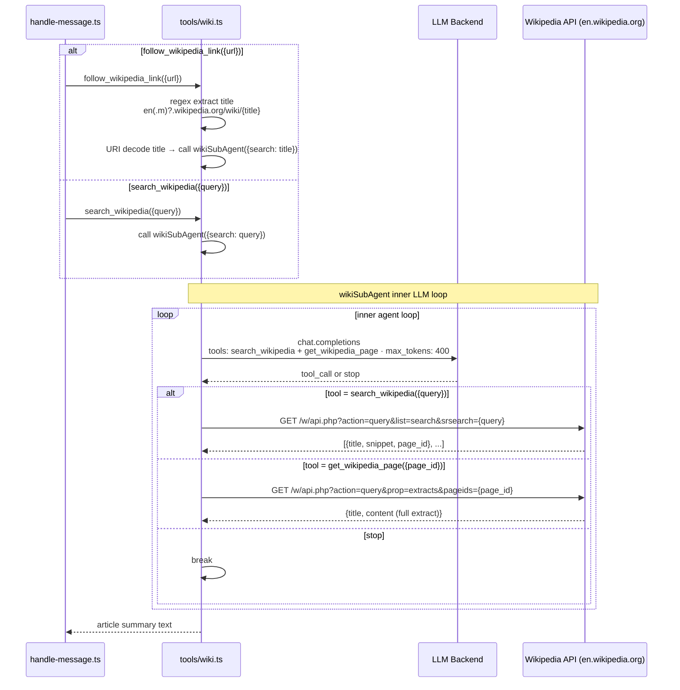
```mermaid
sequenceDiagram
    participant HM as handle-message.ts
    participant Wiki as tools/wiki.ts
    participant Llama as LLM Backend
    participant WP as Wikipedia API (en.wikipedia.org)

    alt follow_wikipedia_link({url})
        HM->>Wiki: follow_wikipedia_link({url})
        Wiki->>Wiki: regex extract title<br/>en(.m)?.wikipedia.org/wiki/{title}
        Wiki->>Wiki: URI decode title → call wikiSubAgent({search: title})
    else search_wikipedia({query})
        HM->>Wiki: search_wikipedia({query})
        Wiki->>Wiki: call wikiSubAgent({search: query})
    end

    Note over Wiki,WP: wikiSubAgent inner LLM loop
    loop inner agent loop
        Wiki->>Llama: chat.completions<br/>tools: search_wikipedia + get_wikipedia_page · max_tokens: 400
        Llama-->>Wiki: tool_call or stop
        alt tool = search_wikipedia({query})
            Wiki->>WP: GET /w/api.php?action=query&list=search&srsearch={query}
            WP-->>Wiki: [{title, snippet, page_id}, ...]
        else tool = get_wikipedia_page({page_id})
            Wiki->>WP: GET /w/api.php?action=query&prop=extracts&pageids={page_id}
            WP-->>Wiki: {title, content (full extract)}
        else stop
            Wiki->>Wiki: break
        end
    end

    Wiki-->>HM: article summary text
```

---

### 4. Weather Tool — `get_weather`

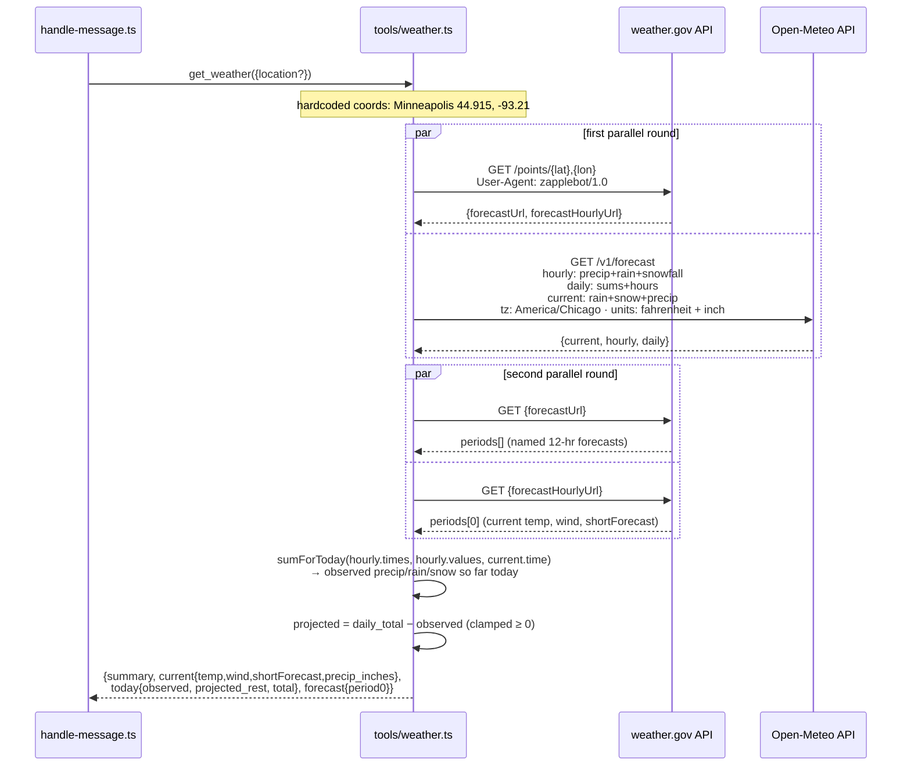
```mermaid
sequenceDiagram
    participant HM as handle-message.ts
    participant W as tools/weather.ts
    participant WGOV as weather.gov API
    participant OM as Open-Meteo API

    HM->>W: get_weather({location?})
    Note over W: hardcoded coords: Minneapolis 44.915, -93.21

    par first parallel round
        W->>WGOV: GET /points/{lat},{lon}<br/>User-Agent: zapplebot/1.0
        WGOV-->>W: {forecastUrl, forecastHourlyUrl}
    and
        W->>OM: GET /v1/forecast<br/>hourly: precip+rain+snowfall<br/>daily: sums+hours<br/>current: rain+snow+precip<br/>tz: America/Chicago · units: fahrenheit + inch
        OM-->>W: {current, hourly, daily}
    end

    par second parallel round
        W->>WGOV: GET {forecastUrl}
        WGOV-->>W: periods[] (named 12-hr forecasts)
    and
        W->>WGOV: GET {forecastHourlyUrl}
        WGOV-->>W: periods[0] (current temp, wind, shortForecast)
    end

    W->>W: sumForToday(hourly.times, hourly.values, current.time)<br/>→ observed precip/rain/snow so far today
    W->>W: projected = daily_total − observed (clamped ≥ 0)
    W-->>HM: {summary, current{temp,wind,shortForecast,precip_inches},<br/>today{observed, projected_rest, total}, forecast{period0}}
```

---

### 5. Snow Emergency Tool — `get_snow_emergency`

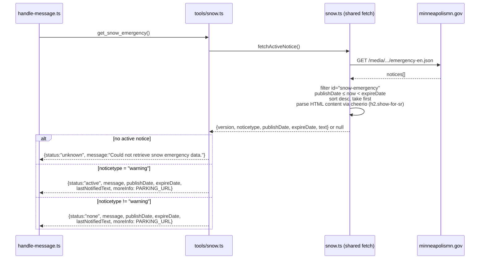
```mermaid
sequenceDiagram
    participant HM as handle-message.ts
    participant ST as tools/snow.ts
    participant Shared as snow.ts (shared fetch)
    participant City as minneapolismn.gov

    HM->>ST: get_snow_emergency()
    ST->>Shared: fetchActiveNotice()
    Shared->>City: GET /media/.../emergency-en.json
    City-->>Shared: notices[]
    Shared->>Shared: filter id="snow-emergency"<br/>publishDate ≤ now < expireDate<br/>sort desc, take first<br/>parse HTML content via cheerio (h2.show-for-sr)
    Shared-->>ST: {version, noticetype, publishDate, expireDate, text} or null

    alt no active notice
        ST-->>HM: {status:"unknown", message:"Could not retrieve snow emergency data."}
    else noticetype = "warning"
        ST-->>HM: {status:"active", message, publishDate, expireDate,<br/>lastNotifiedText, moreInfo: PARKING_URL}
    else noticetype != "warning"
        ST-->>HM: {status:"none", message, publishDate, expireDate,<br/>lastNotifiedText, moreInfo: PARKING_URL}
    end
```

---

### 6. GitHub Tools — `bugReport`, `readBugs`, `readRepoFile`

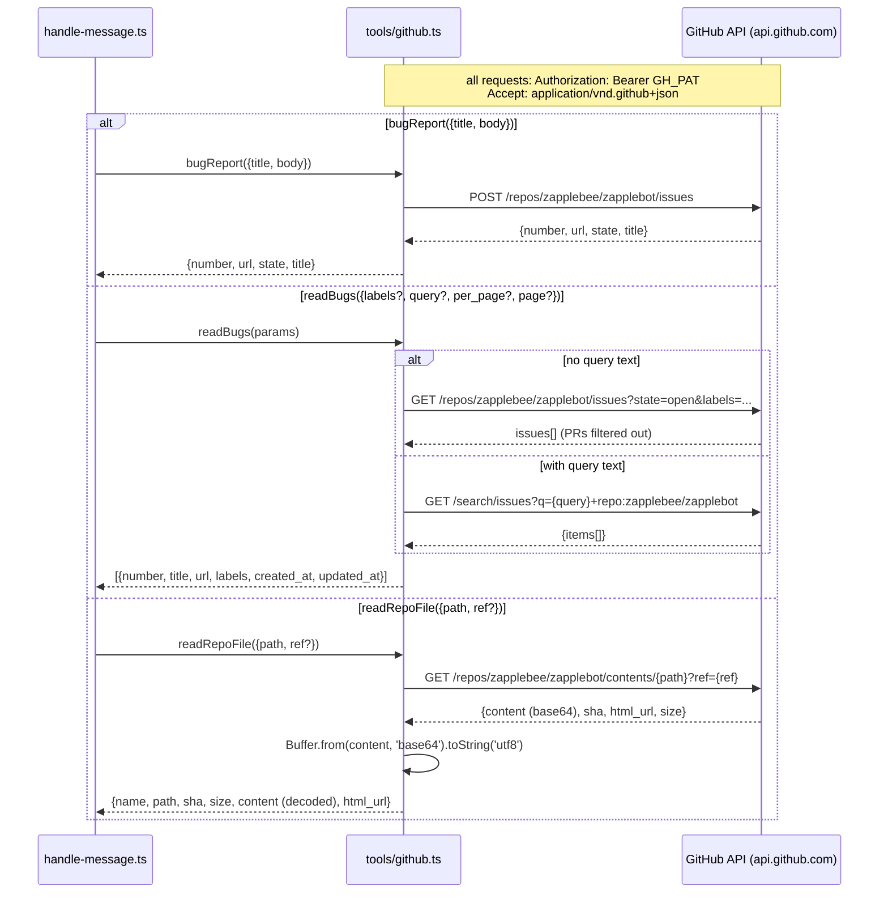
```mermaid
sequenceDiagram
    participant HM as handle-message.ts
    participant GH as tools/github.ts
    participant GHAPI as GitHub API (api.github.com)

    Note over GH,GHAPI: all requests: Authorization: Bearer GH_PAT<br/>Accept: application/vnd.github+json

    alt bugReport({title, body})
        HM->>GH: bugReport({title, body})
        GH->>GHAPI: POST /repos/zapplebee/zapplebot/issues
        GHAPI-->>GH: {number, url, state, title}
        GH-->>HM: {number, url, state, title}

    else readBugs({labels?, query?, per_page?, page?})
        HM->>GH: readBugs(params)
        alt no query text
            GH->>GHAPI: GET /repos/zapplebee/zapplebot/issues?state=open&labels=...
            GHAPI-->>GH: issues[] (PRs filtered out)
        else with query text
            GH->>GHAPI: GET /search/issues?q={query}+repo:zapplebee/zapplebot
            GHAPI-->>GH: {items[]}
        end
        GH-->>HM: [{number, title, url, labels, created_at, updated_at}]

    else readRepoFile({path, ref?})
        HM->>GH: readRepoFile({path, ref?})
        GH->>GHAPI: GET /repos/zapplebee/zapplebot/contents/{path}?ref={ref}
        GHAPI-->>GH: {content (base64), sha, html_url, size}
        GH->>GH: Buffer.from(content, 'base64').toString('utf8')
        GH-->>HM: {name, path, sha, size, content (decoded), html_url}
    end
```

---

### 7. TypeScript Sandbox — `run_typescript_javascript`

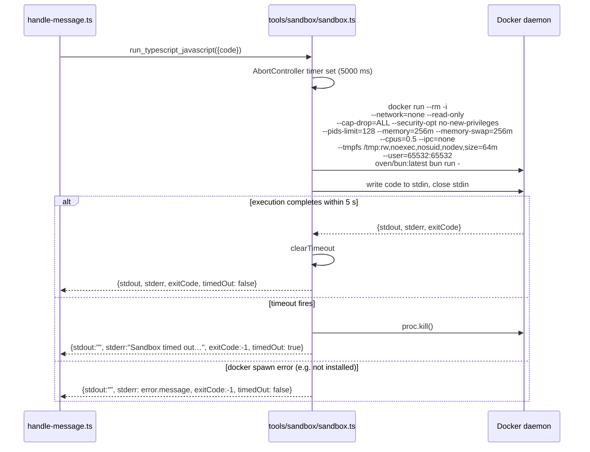
```mermaid
sequenceDiagram
    participant HM as handle-message.ts
    participant SB as tools/sandbox/sandbox.ts
    participant Docker as Docker daemon

    HM->>SB: run_typescript_javascript({code})
    SB->>SB: AbortController timer set (5000 ms)
    SB->>Docker: docker run --rm -i<br/>--network=none --read-only<br/>--cap-drop=ALL --security-opt no-new-privileges<br/>--pids-limit=128 --memory=256m --memory-swap=256m<br/>--cpus=0.5 --ipc=none<br/>--tmpfs /tmp:rw,noexec,nosuid,nodev,size=64m<br/>--user=65532:65532<br/>oven/bun:latest bun run -
    SB->>Docker: write code to stdin, close stdin

    alt execution completes within 5 s
        Docker-->>SB: {stdout, stderr, exitCode}
        SB->>SB: clearTimeout
        SB-->>HM: {stdout, stderr, exitCode, timedOut: false}
    else timeout fires
        SB->>Docker: proc.kill()
        SB-->>HM: {stdout:"", stderr:"Sandbox timed out…", exitCode:-1, timedOut: true}
    else docker spawn error (e.g. not installed)
        SB-->>HM: {stdout:"", stderr: error.message, exitCode:-1, timedOut: false}
    end
```

---

### 8. Scoreboard Tools — `update_score_board`, `get_score_board`, `score_board_score_names`

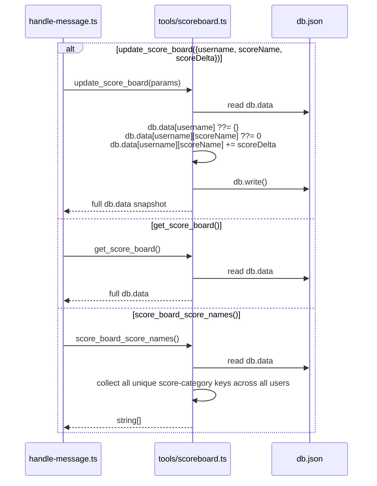
```mermaid
sequenceDiagram
    participant HM as handle-message.ts
    participant SB as tools/scoreboard.ts
    participant DB as db.json

    alt update_score_board({username, scoreName, scoreDelta})
        HM->>SB: update_score_board(params)
        SB->>DB: read db.data
        SB->>SB: db.data[username] ??= {}<br/>db.data[username][scoreName] ??= 0<br/>db.data[username][scoreName] += scoreDelta
        SB->>DB: db.write()
        SB-->>HM: full db.data snapshot

    else get_score_board()
        HM->>SB: get_score_board()
        SB->>DB: read db.data
        SB-->>HM: full db.data

    else score_board_score_names()
        HM->>SB: score_board_score_names()
        SB->>DB: read db.data
        SB->>SB: collect all unique score-category keys across all users
        SB-->>HM: string[]
    end
```

---

### 9. Memory Tool — `add_persistent_memory`

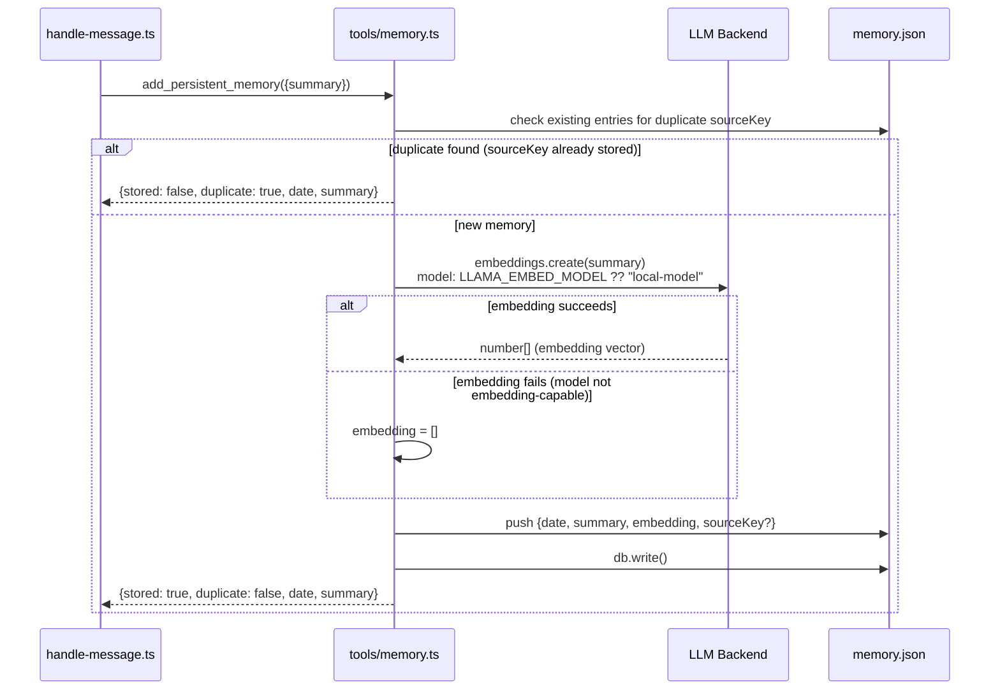
```mermaid
sequenceDiagram
    participant HM as handle-message.ts
    participant MT as tools/memory.ts
    participant Llama as LLM Backend
    participant Mem as memory.json

    HM->>MT: add_persistent_memory({summary})
    MT->>Mem: check existing entries for duplicate sourceKey

    alt duplicate found (sourceKey already stored)
        MT-->>HM: {stored: false, duplicate: true, date, summary}
    else new memory
        MT->>Llama: embeddings.create(summary)<br/>model: LLAMA_EMBED_MODEL ?? "local-model"
        alt embedding succeeds
            Llama-->>MT: number[] (embedding vector)
        else embedding fails (model not embedding-capable)
            MT->>MT: embedding = []
        end
        MT->>Mem: push {date, summary, embedding, sourceKey?}
        MT->>Mem: db.write()
        MT-->>HM: {stored: true, duplicate: false, date, summary}
    end
```

---

### 10. Local / Computed Tools

These tools make no network calls; all results are computed from in-process state.

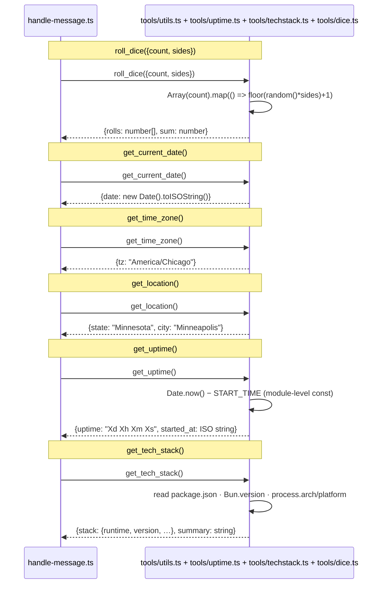
```mermaid
sequenceDiagram
    participant HM as handle-message.ts
    participant T as tools/utils.ts + tools/uptime.ts + tools/techstack.ts + tools/dice.ts

    Note over HM,T: roll_dice({count, sides})
    HM->>T: roll_dice({count, sides})
    T->>T: Array(count).map(() => floor(random()*sides)+1)
    T-->>HM: {rolls: number[], sum: number}

    Note over HM,T: get_current_date()
    HM->>T: get_current_date()
    T-->>HM: {date: new Date().toISOString()}

    Note over HM,T: get_time_zone()
    HM->>T: get_time_zone()
    T-->>HM: {tz: "America/Chicago"}

    Note over HM,T: get_location()
    HM->>T: get_location()
    T-->>HM: {state: "Minnesota", city: "Minneapolis"}

    Note over HM,T: get_uptime()
    HM->>T: get_uptime()
    T->>T: Date.now() − START_TIME (module-level const)
    T-->>HM: {uptime: "Xd Xh Xm Xs", started_at: ISO string}

    Note over HM,T: get_tech_stack()
    HM->>T: get_tech_stack()
    T->>T: read package.json · Bun.version · process.arch/platform
    T-->>HM: {stack: {runtime, version, …}, summary: string}
```

---

### 11. Vela CLI Tool — `run_vela_cli`

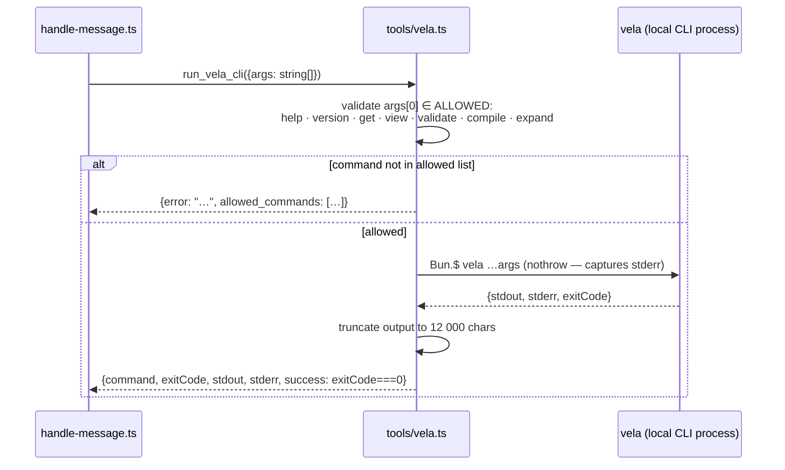
```mermaid
sequenceDiagram
    participant HM as handle-message.ts
    participant V as tools/vela.ts
    participant Vela as vela (local CLI process)

    HM->>V: run_vela_cli({args: string[]})
    V->>V: validate args[0] ∈ ALLOWED:<br/>help · version · get · view · validate · compile · expand

    alt command not in allowed list
        V-->>HM: {error: "…", allowed_commands: […]}
    else allowed
        V->>Vela: Bun.$ vela …args (nothrow — captures stderr)
        Vela-->>V: {stdout, stderr, exitCode}
        V->>V: truncate output to 12 000 chars
        V-->>HM: {command, exitCode, stdout, stderr, success: exitCode===0}
    end
```

---

### 12. Cron — Snow Emergency Checker (every 30 min)

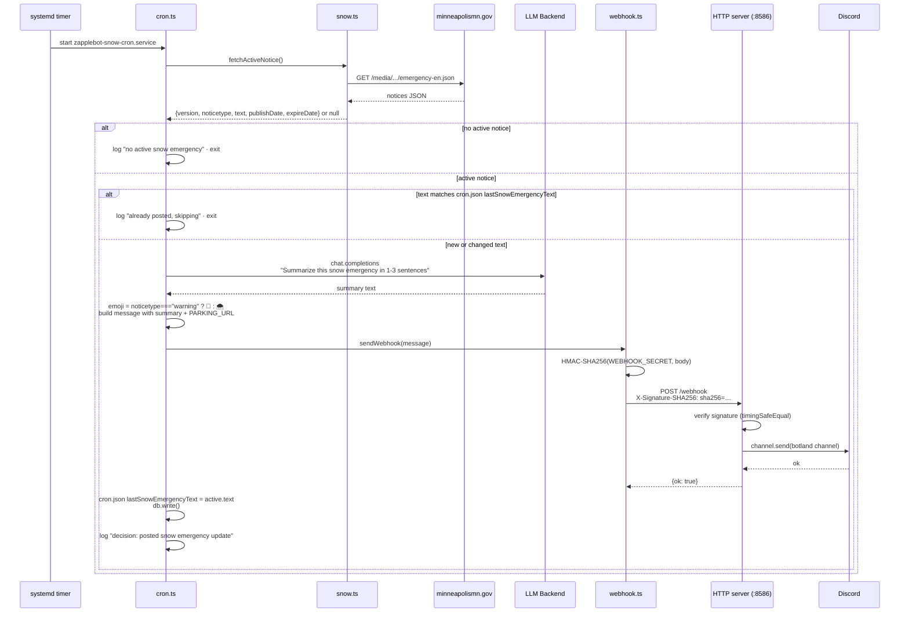
```mermaid
sequenceDiagram
    participant Systemd as systemd timer
    participant Cron as cron.ts
    participant Snow as snow.ts
    participant City as minneapolismn.gov
    participant Llama as LLM Backend
    participant WH as webhook.ts
    participant Server as HTTP server (:8586)
    participant Discord

    Systemd->>Cron: start zapplebot-snow-cron.service
    Cron->>Snow: fetchActiveNotice()
    Snow->>City: GET /media/.../emergency-en.json
    City-->>Snow: notices JSON
    Snow-->>Cron: {version, noticetype, text, publishDate, expireDate} or null

    alt no active notice
        Cron->>Cron: log "no active snow emergency" · exit
    else active notice
        alt text matches cron.json lastSnowEmergencyText
            Cron->>Cron: log "already posted, skipping" · exit
        else new or changed text
            Cron->>Llama: chat.completions<br/>"Summarize this snow emergency in 1-3 sentences"
            Llama-->>Cron: summary text
            Cron->>Cron: emoji = noticetype==="warning" ? 🚨 : 🌨️<br/>build message with summary + PARKING_URL
            Cron->>WH: sendWebhook(message)
            WH->>WH: HMAC-SHA256(WEBHOOK_SECRET, body)
            WH->>Server: POST /webhook<br/>X-Signature-SHA256: sha256=…
            Server->>Server: verify signature (timingSafeEqual)
            Server->>Discord: channel.send(botland channel)
            Discord-->>Server: ok
            Server-->>WH: {ok: true}
            Cron->>Cron: cron.json lastSnowEmergencyText = active.text<br/>db.write()
            Cron->>Cron: log "decision: posted snow emergency update"
        end
    end
```

---

### 13. HTTP Server & Webhook

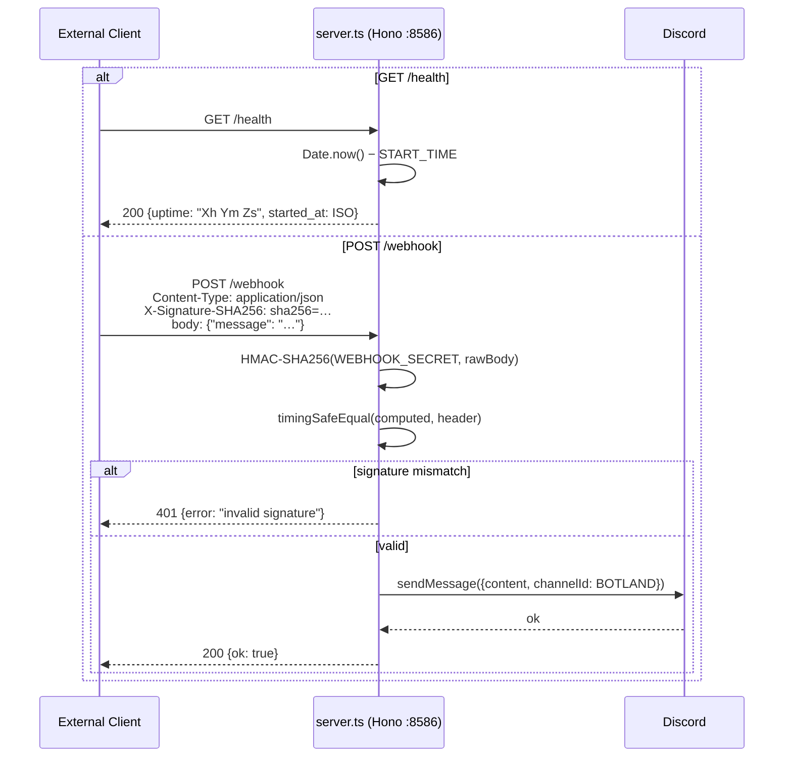
```mermaid
sequenceDiagram
    participant Client as External Client
    participant Server as server.ts (Hono :8586)
    participant Discord

    alt GET /health
        Client->>Server: GET /health
        Server->>Server: Date.now() − START_TIME
        Server-->>Client: 200 {uptime: "Xh Ym Zs", started_at: ISO}

    else POST /webhook
        Client->>Server: POST /webhook<br/>Content-Type: application/json<br/>X-Signature-SHA256: sha256=…<br/>body: {"message": "…"}
        Server->>Server: HMAC-SHA256(WEBHOOK_SECRET, rawBody)
        Server->>Server: timingSafeEqual(computed, header)
        alt signature mismatch
            Server-->>Client: 401 {error: "invalid signature"}
        else valid
            Server->>Discord: sendMessage({content, channelId: BOTLAND})
            Discord-->>Server: ok
            Server-->>Client: 200 {ok: true}
        end
    end
```

---

### 14. Memory — 📌 Pin Reactions

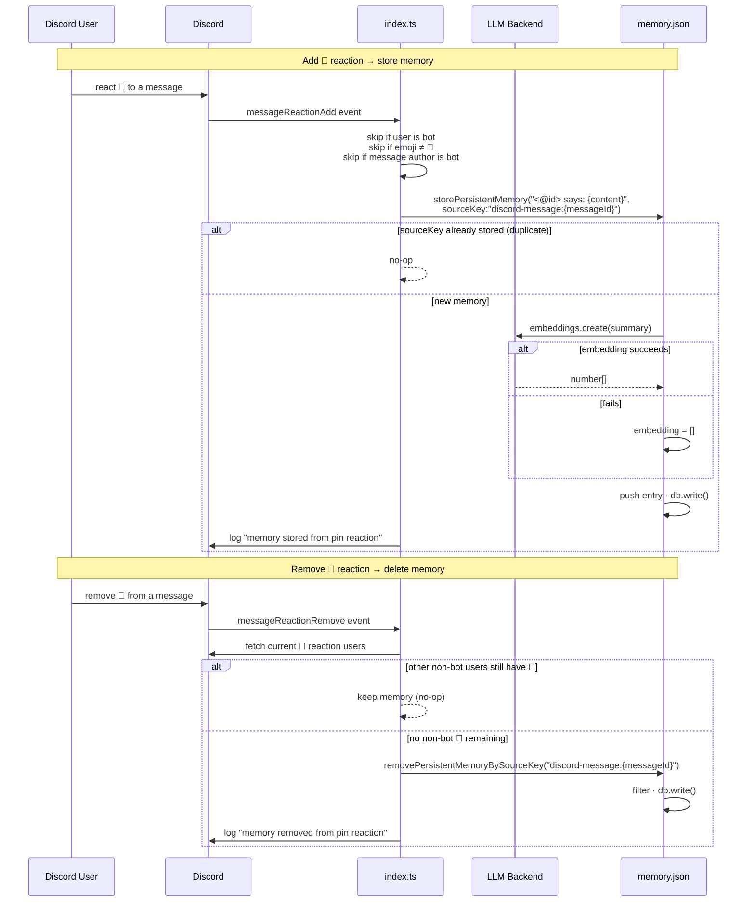
```mermaid
sequenceDiagram
    participant User as Discord User
    participant Discord
    participant Bot as index.ts
    participant Llama as LLM Backend
    participant Mem as memory.json

    Note over User,Mem: Add 📌 reaction → store memory
    User->>Discord: react 📌 to a message
    Discord->>Bot: messageReactionAdd event
    Bot->>Bot: skip if user is bot<br/>skip if emoji ≠ 📌<br/>skip if message author is bot
    Bot->>Mem: storePersistentMemory("<@id> says: {content}",<br/>sourceKey:"discord-message:{messageId}")
    alt sourceKey already stored (duplicate)
        Bot-->>Bot: no-op
    else new memory
        Mem->>Llama: embeddings.create(summary)
        alt embedding succeeds
            Llama-->>Mem: number[]
        else fails
            Mem->>Mem: embedding = []
        end
        Mem->>Mem: push entry · db.write()
        Bot->>Discord: log "memory stored from pin reaction"
    end

    Note over User,Mem: Remove 📌 reaction → delete memory
    User->>Discord: remove 📌 from a message
    Discord->>Bot: messageReactionRemove event
    Bot->>Discord: fetch current 📌 reaction users
    alt other non-bot users still have 📌
        Bot-->>Bot: keep memory (no-op)
    else no non-bot 📌 remaining
        Bot->>Mem: removePersistentMemoryBySourceKey("discord-message:{messageId}")
        Mem->>Mem: filter · db.write()
        Bot->>Discord: log "memory removed from pin reaction"
    end
```

---

### 15. D&D Combat — slash commands & tool (requires `ENABLE_DND=true`)

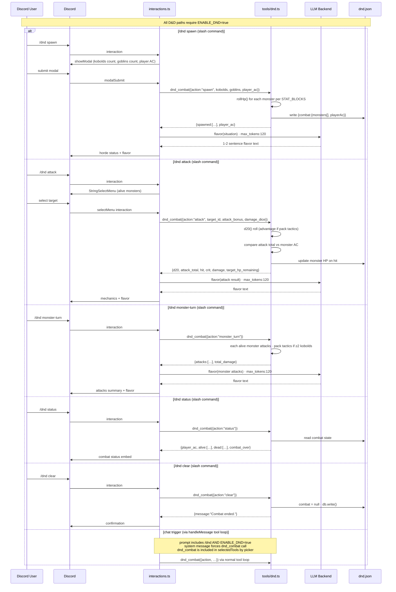
```mermaid
sequenceDiagram
    participant User as Discord User
    participant Discord
    participant Bot as interactions.ts
    participant DND as tools/dnd.ts
    participant Llama as LLM Backend
    participant DNDJ as dnd.json

    Note over User,DNDJ: All D&D paths require ENABLE_DND=true

    alt /dnd spawn (slash command)
        User->>Discord: /dnd spawn
        Discord->>Bot: interaction
        Bot->>Discord: showModal (kobolds count, goblins count, player AC)
        User->>Discord: submit modal
        Discord->>Bot: modalSubmit
        Bot->>DND: dnd_combat({action:"spawn", kobolds, goblins, player_ac})
        DND->>DND: rollHp() for each monster per STAT_BLOCKS
        DND->>DNDJ: write {combat:{monsters[], playerAc}}
        DND-->>Bot: {spawned:[…], player_ac}
        Bot->>Llama: flavor(situation) · max_tokens:120
        Llama-->>Bot: 1-2 sentence flavor text
        Bot->>Discord: horde status + flavor

    else /dnd attack (slash command)
        User->>Discord: /dnd attack
        Discord->>Bot: interaction
        Bot->>Discord: StringSelectMenu (alive monsters)
        User->>Discord: select target
        Discord->>Bot: selectMenu interaction
        Bot->>DND: dnd_combat({action:"attack", target_id, attack_bonus, damage_dice})
        DND->>DND: d20() roll (advantage if pack tactics)
        DND->>DND: compare attack total vs monster AC
        DND->>DNDJ: update monster HP on hit
        DND-->>Bot: {d20, attack_total, hit, crit, damage, target_hp_remaining}
        Bot->>Llama: flavor(attack result) · max_tokens:120
        Llama-->>Bot: flavor text
        Bot->>Discord: mechanics + flavor

    else /dnd monster-turn (slash command)
        User->>Discord: /dnd monster-turn
        Discord->>Bot: interaction
        Bot->>DND: dnd_combat({action:"monster_turn"})
        DND->>DND: each alive monster attacks · pack tactics if ≥2 kobolds
        DND-->>Bot: {attacks:[…], total_damage}
        Bot->>Llama: flavor(monster attacks) · max_tokens:120
        Llama-->>Bot: flavor text
        Bot->>Discord: attacks summary + flavor

    else /dnd status (slash command)
        User->>Discord: /dnd status
        Discord->>Bot: interaction
        Bot->>DND: dnd_combat({action:"status"})
        DND->>DNDJ: read combat state
        DND-->>Bot: {player_ac, alive:[…], dead:[…], combat_over}
        Bot->>Discord: combat status embed

    else /dnd clear (slash command)
        User->>Discord: /dnd clear
        Discord->>Bot: interaction
        Bot->>DND: dnd_combat({action:"clear"})
        DND->>DNDJ: combat = null · db.write()
        DND-->>Bot: {message:"Combat ended."}
        Bot->>Discord: confirmation

    else chat trigger (via handleMessage tool loop)
        Note over Bot,DND: prompt includes /dnd AND ENABLE_DND=true<br/>system message forces dnd_combat call<br/>dnd_combat is included in selectedTools by picker
        Bot->>DND: dnd_combat({action, …}) via normal tool loop
    end
```

---

## Memory

- Stored in `memory.json` via lowdb.
- Retrieval uses cosine similarity on embeddings when available, falls back to most-recent-5.
- The bot stores stable, long-lived facts (preferences, identity, ongoing projects, repeated corrections, explicit remember-this statements).
- If the bot stores a memory during a reply, it reacts to the triggering message with `📌`.
- Users can also add `📌` to a message to store that message as memory; if all non-bot `📌` reactions are removed, that synced memory is deleted.
- Not stored: one-off statements, emotional state, session-only context.

---

## Logging

Two log files, both structured JSON via Winston. Every entry carries a `sha` field with the short git commit hash of the running build, making it easy to correlate behaviour changes with deployments.

| File | Contents |
|---|---|
| `chat.log` | All debug/info/warn/error events — bot, cron, and HTTP server |
| `convo.log` | Full request and response payloads per `chatId` (messages array, tool calls, results) |

Both the bot process and cron jobs append to `chat.log`. `convo.log` is written only by `handleMessage`.

**View live logs:**

```bash
tail -f chat.log | python3 -c "
import sys, json
for line in sys.stdin:
    e = json.loads(line.strip())
    print(e['timestamp'][:19], e['level'].upper(), e['message'])
"
```

**View systemd journal** (stdout/stderr, startup errors):

```bash
journalctl --user -u zapplebot.service -f
journalctl --user -u zapplebot-snow-cron.service -n 50
```

Key log fields:

```json
{ "sha": "f905eec", "chatId": "...", "message": "tool picker", "selected": ["roll_dice", "add_persistent_memory"] }
{ "sha": "f905eec", "chatId": "...", "message": "llm response", "turn": 1, "finish_reason": "tool_calls", "usage": {...} }
{ "sha": "f905eec", "chatId": "...", "message": "tool call", "tool": "roll_dice", "success": true, "duration_ms": 0 }
{ "sha": "f905eec", "chatId": "...", "message": "handle complete", "turns": 2, "toolCallCount": 1, "total_ms": 4200 }
{ "sha": "f905eec", "process": "snow-emergency-cron", "message": "decision: already posted, skipping", "version": "..." }
```

---

## Testing

```bash
# Fast unit tests — no LLM required
bun run test:unit

# Integration tests — requires LLM backend running
bun run test:integration

# Both suites
bun run test
```

`unit.test.ts` covers tool schema validation and pure logic with no LLM calls. `integration.test.ts` covers all 20 tools and the full `handleMessage` loop against the live backend. Timeouts are disabled (`--timeout 0`) to accommodate CPU inference.

---

## Mac Mini Setup

For running llama.cpp as a persistent system service on a shared Mac (survives user switching), see **[MAC_MINI_SETUP.md](./MAC_MINI_SETUP.md)**.

---

## Persistence Files

| File | Contents |
|---|---|
| `memory.json` | Long-term user memories with embeddings |
| `db.json` | Scoreboard data |
| `cron.json` | Cron job state (last posted snow emergency version) |
| `dnd.json` | D&D combat state (written when `ENABLE_DND=true`) |
| `chat.log` | Structured interaction logs (all processes) |
| `convo.log` | Full request/response payloads per `chatId` |

These are gitignored. Back them up if they matter.
